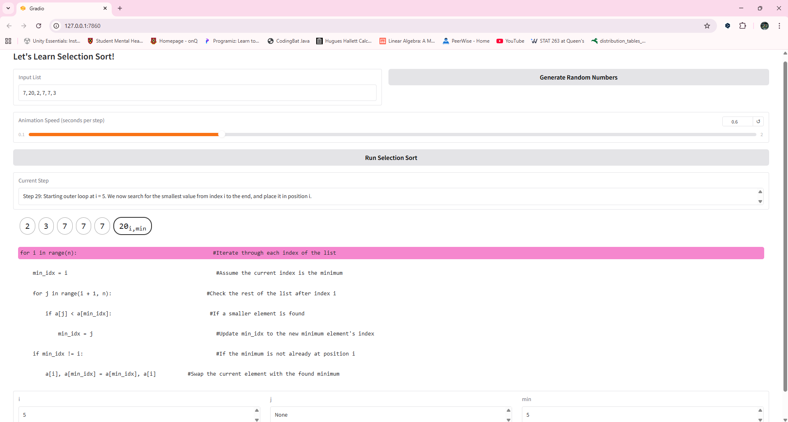
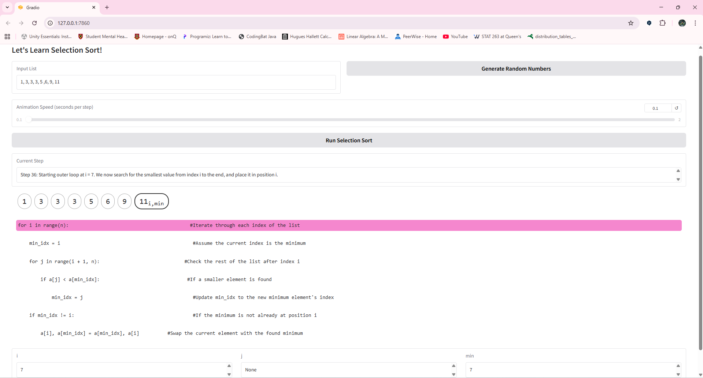
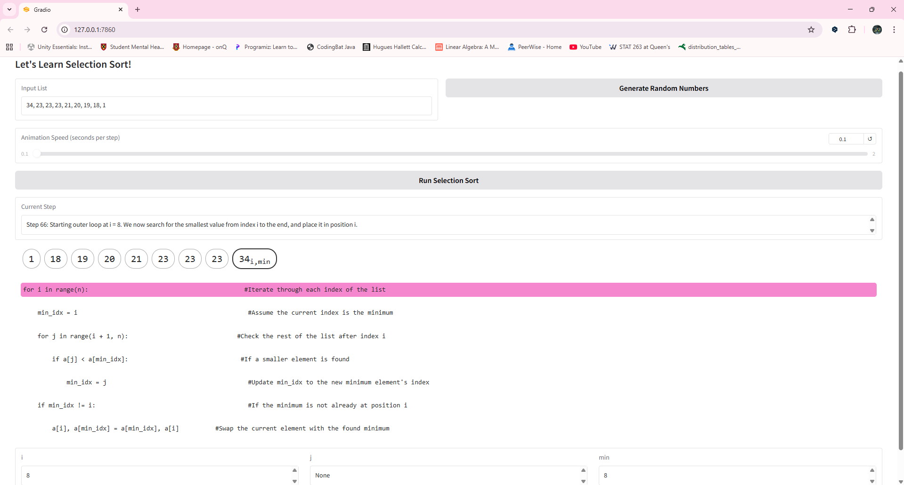
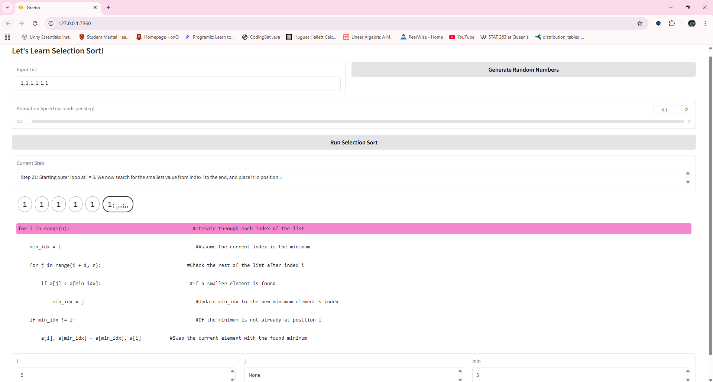
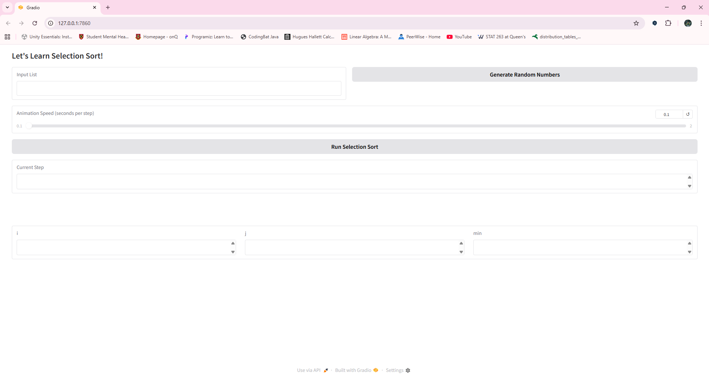
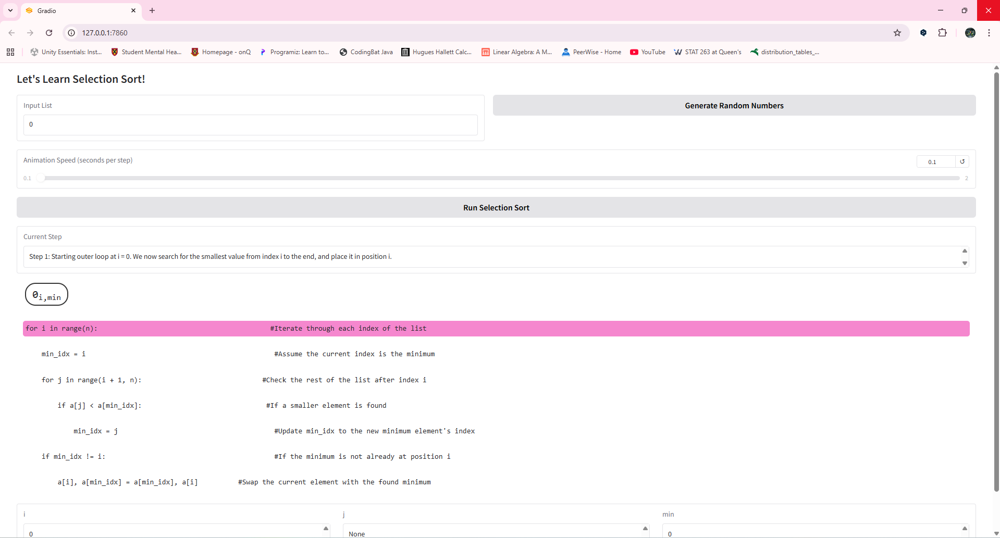
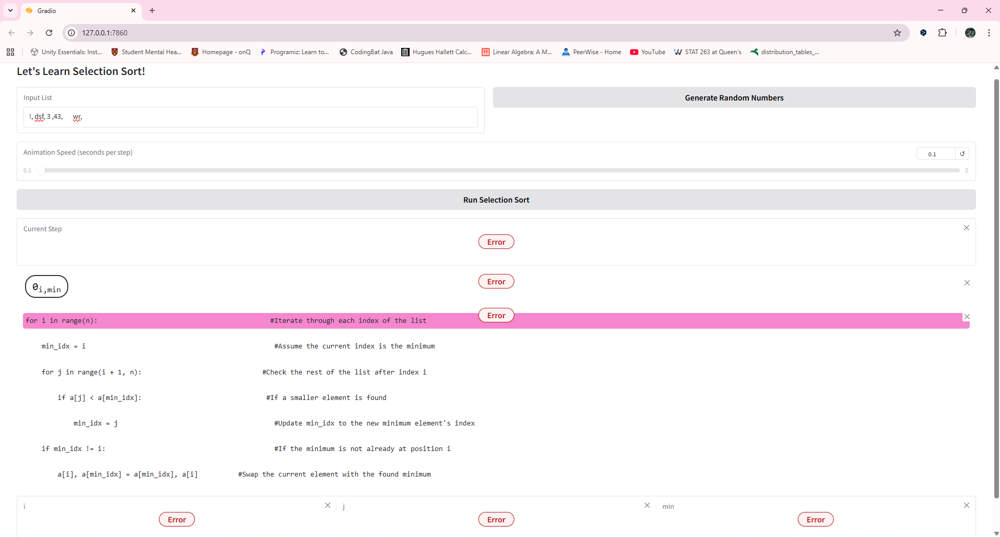

#Selection Sort

##Hunggingface Link

https://huggingface.co/spaces/PrideAndPrejudice/selection-sort-visualize

##Screenshot of test   

Input unsorted, several duplicate array, works fine

Input sorted array with severl duplicates, works fine

Input reverse order and several duplicates array, works fine

Input array with all elements equal, works fine

Input empty array, works fine

Input array with single element, works fine

Invalid input, not crush, still can work after valid input, consider works fine

\##Decomposition

The app needs to be able to accept user input some random numbers, run a selection sorting process in a controlled way, turn that process into a sequence of visual states, and finally display those states through a state machine. In fact the most heavy work is just the UI, and could start from a template of gradio library. To keep this manageable, I separate the work into several modules.

First, there is the core algorithm module, which is responsible not only for sorting the list but also for walking through the algorithm step by step and recording relevant information. Each recorded state contains a copy of the array and a description of what the algorithm is doing at that moment. This module can also generate short explanatory messages using a few sentence templates with varying parameters such as pointer positions or swap details.

Second, there is the animation module, which takes the recorded states and exposes them one by one, effectively turning them into animation frames. Each frame is associated with a short, adjustable delay so that the viewer can slow down or speed up the visualization.

Third, there is the visual representation module, responsible for turning a raw Python list and some indices into something that can shows the array as boxes, labels the positions of important variables, and highlights the current line of the code of the algorithm that corresponds to the current action. 

Finally, the Gradio interface module ties everything together. It handles text input for numbers, a button for generating random values, a slider for adjusting animation speed, and multiple output areas for status text, array visualization, and code highlighting.

\##Pattern Recognition

Once the project is decomposed into these pieces, some patterns become apparent. Every run of the app follows a similar steps: the user input a list, presses a button, and then watches a sequence of small, repeated updates. Each “frame” of the animation has the same structure: a snapshot of the array, a few indices that move in a predictable way, at the same time, a short textual explanation of what is happening in a text box. In the control flow. The pattern “input → compute all steps → stream steps to the UI” is the same, no matter what specific data the user enters, the algorithm can run any size of the input array, just the more or less reptations of the flow. The user interface itself is built on repeated layouts: the same array boxes are redrawn with only small changes, the same code block stays on screen with only one line highlighted at a time, and the same explanation field is updated each step.

\##Abstraction

One important design decision is determining what information should be visible to the user. The implementation involves many details, but exposing all of them would make the interface confusing. The goal of this project is educational visualization, rather than low-level terminal. Therefore, the display focuses on only a few elements that are essential for understanding: the current array shown as visual boxes, the three index markers (i, j, and min) attached to relevant elements, a highlighted line of pseudo-code that reflects the current algorithmic action, and a short textual explanation describing what is happening. Everything else is hidden. This abstraction layer separates “how the program works internally” from “what the user needs to see”, should making the visualization clearer.

\##Algorithm Design

\#Input

The interface provides a textbox where users can type numbers separated by commas.

A “Generate Random Numbers” button allows users to create a valid input list without typing manually.

An animation-speed slider lets users choose how long each step remains visible.

\#Processing

The app parses the input into a Python list and validates it.

The function selection\_sort\_steps walks through the selection sort algorithm and records every important step, including i, j, min\_idx, and a snapshot of the array.

A generator function animate\_selection\_sort processes these recorded steps one at a time and identifies which line of pseudo-code should be highlighted.

\#Output

A status box shows a explanation of what is happening in the current step.

The visual array representation shows each element as a box, with i, j, and min markers added where appropriate.

A dedicated block displays the pseudo-code and highlights the current line.

Three additional text boxes track the variables i, j, and min so users can observe how the indices evolve throughout the process.

Author: Linfeng Shangguan

Course: CISC-121 (Fall 2025)
